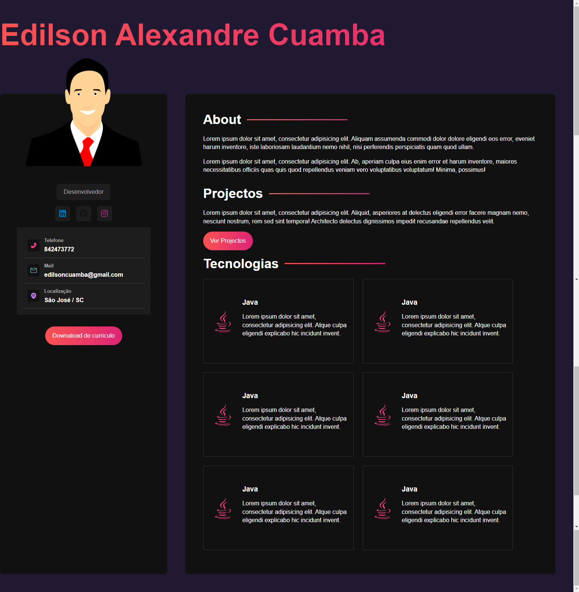

# React e Sass by Hora de Codar
Desenvolvimento de um portfolio usando sass e react.

## Comandos utilizados
1. **npm install vide@latest** -> Instala a ultima versão do vite
2. **npm install -D sass** -> instala o preprocessador sass
3. **npm install react-icons** -> instala a biblioteca de icons do react.
4. **npm run dev** -> inicia o servidor em modo desenvolvimento

## Screeshoot

